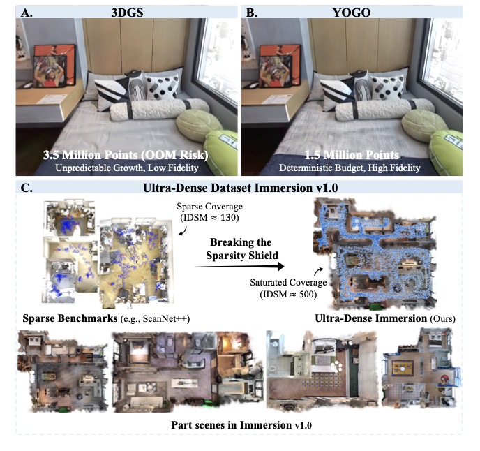
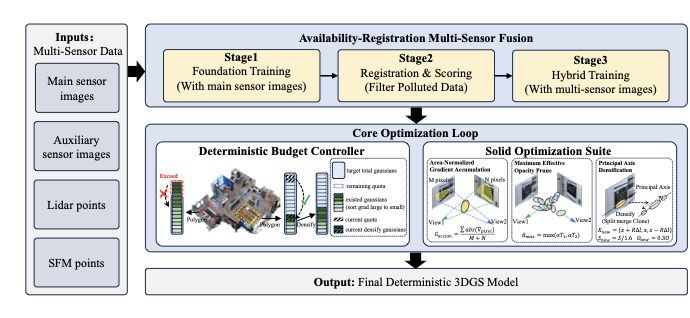
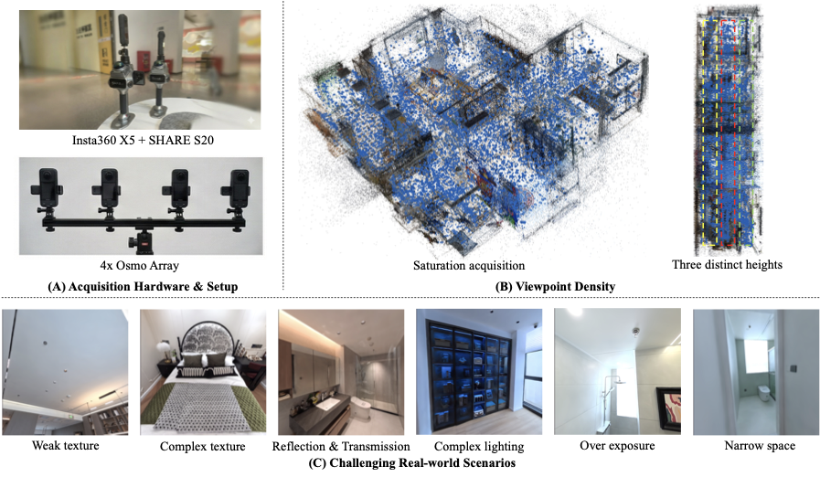
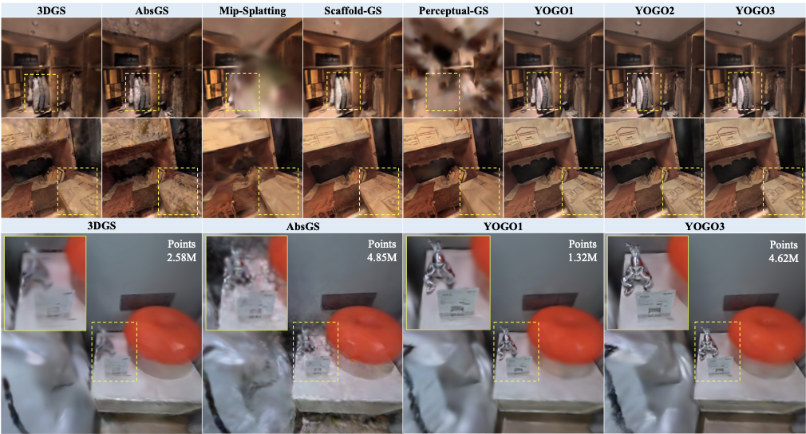

# You Only Gaussian Once: Controllable 3D Gaussian Splatting for Ultra-Densely Sampled Scenes

<p align="center">
  <strong>Jinrang Jia, Zhenjia Li, Yifeng Shi</strong>
</p>

<p align="center">
  <strong>Ke Holdings Inc.</strong>
</p>

<p align="center">
  
  <a href="https://jjrcn.github.io/YOGO/"></a>
  <a href="https://huggingface.co/datasets/JiaJinrang/Immersion"></a>
  <a href="LICENSE"></a>
</p>

YOGO (You Only Gaussian Once) is a production-oriented 3D Gaussian Splatting framework for controllable, high-fidelity reconstruction of ultra-densely sampled scenes. It addresses the industry-academia gap in 3DGS by replacing heuristic Gaussian growth with a deterministic, budget-aware equilibrium, improving resource predictability under hardware constraints.

The system integrates budget-controlled Gaussian allocation and robust multi-sensor fusion, targeting physical fidelity rather than benchmark-friendly hallucination under sparse viewpoints. Together with Immersion v1.0, an ultra-dense indoor dataset designed to break the "sparsity shield," YOGO provides a practical path toward production-grade 3DGS with state-of-the-art visual quality and a deterministic resource profile.

This repository keeps the training and rendering algorithms in the paper implementation unchanged. The top-level scripts are thin wrappers around `train.py` and `render_single.py`.

<p align="center">
  
</p>

## Core Architectural Design

<p align="center">
  
</p>

The YOGO pipeline begins with multi-sensor data undergoing Availability-Registration Multi-Sensor Fusion to filter polluted inputs. Under the deterministic budget controller, the number of Gaussian points at each stage is strictly controlled, which regulates growth based on preset constraints and Polygon regions. The process is enhanced by the Solid Optimization Suite for robust handling of complex textures.

## Immersion v1.0 Dataset

<p align="center">
  
</p>

The Immersion Dataset: (A) Heterogeneous multi-sensor capture rigs. (B) Ultra-dense capture that breaks the "sparsity shield." (C) Example frames showing challenging real-world attributes: weak texture, complex texture, high specularity & transmission, complex lighting, over exposure, and narrow space.

## News

The arXiv link will be added once it is publicly available.

## Project Layout

```text
.
|-- train.py                       # Main training entry point
|-- render_single.py               # Render a trained point cloud from COLMAP cameras
|-- train_base.sh                  # Stage 1: base model training
|-- train_expo.sh                  # Stage 2: exposure-only refinement and filtering
|-- train_fusion.sh                # Stage 3: fusion training using filtered images
|-- run_all.sh                     # Runs all three training stages
|-- render.sh                      # Example rendering wrapper
|-- arguments/                     # Command-line parameter groups
|-- gaussian_renderer/             # Rasterizer-facing render wrapper
|-- scene/                         # Dataset loading, cameras, Gaussian model, viewer, bilateral grid
|-- submodules/                    # Local CUDA extensions
|-- tools/                         # Utility scripts
|-- utils/                         # Math, image, loss, COLMAP, and system utilities
`-- lpipsPyTorch/                  # LPIPS metric wrapper
```

## Installation

The training environment used for this codebase is based on Python 3.10, PyTorch 2.1.0, and CUDA 11.8. A typical setup is:

```bash
conda create -n yogo python=3.10
conda activate yogo
pip install -r requirements.txt
```

`requirements.txt` installs the bundled CUDA extensions from local relative paths:

```text
submodules/diff-gaussian-rasterization
submodules/simple-knn
submodules/fused-ssim
```

For the optional interactive viewer:

```bash
pip install -r requirements-viewer.txt
```

## Data Layout

The COLMAP loader expects each scene to contain:

```text
scene_name/
|-- images/
|-- sparse/0/images.bin     
|-- sparse/0/cameras.bin  
|-- sparse/0/points3D.ply    # lidar + SfM for init points
|-- depths/                  
|-- masks/                   
`-- val_list.txt             # validation image list
```

Optional arguments can point to external sparse or point-cloud paths:

```text
--sparse_dir /path/to/scene/sparse/
--points3D_dir /path/to/scene/sparse/0/points3D.ply
```

If object-level controls are needed, pass a JSON box list with `--polygon_3d_list_path`.

## Training

For one scene, call `train.py` directly:

```bash
python train.py \
  -s /path/to/scene \
  -d /path/to/scene/depths \
  --masks /path/to/scene/masks \
  -m ./output_YOGO_base/scene00001 \
  --optimizer_type sparse_adam \
  --train_test_exp \
  --sparse_dir /path/to/scene/sparse/ \
  --points3D_dir /path/to/scene/sparse/0/points3D.ply \
  --sensor_mod only_x5
```

For the default three-stage workflow, edit the scene list in `train_base.sh`, `train_expo.sh`, and `train_fusion.sh`, or set `DATA_DIR` before running:

```bash
DATA_DIR=/path/to/data bash run_all.sh
```

The scripts launch one process per scene and choose GPUs by currently free memory using `nvidia-smi`.

## Rendering

Use `render_single.py` directly:

```bash
python render_single.py \
  --ply_path /path/to/iteration/point_cloud.ply \
  --exp_name YOGO \
  --images_txt_bin_path /path/to/images.txt \
  --cameras_txt_bin_path /path/to/cameras.txt \
  --sample_stride 1 \
  --image_downsample 1
```

Or set environment variables for the wrapper:

```bash
MODEL_BASE_PATH=/path/to/iteration \
IMAGES_TXT_BIN_PATH=/path/to/images.txt \
CAMERAS_TXT_BIN_PATH=/path/to/cameras.txt \
bash render.sh
```

## Qualitative Comparison

<p align="center">
  
</p>

## Citation

If you find this project useful, please cite:

```bibtex
@article{happyDog,
  author    = {Jia, Jinrang and Li, Zhenjia and Shi, Yifeng},
  title     = {You Only Gaussian Once: Controllable 3D Gaussian Splatting for Ultra-Densely Sampled Scenes},
  journal   = {arXiv preprint arXiv:2511.11233},
  year      = {2025},
}
```

## License

This project is released under the MIT License. See [LICENSE](LICENSE) for details.

Third-party code and CUDA extensions under `submodules/` retain their original licenses. Please check the corresponding license files before redistribution or commercial use.
